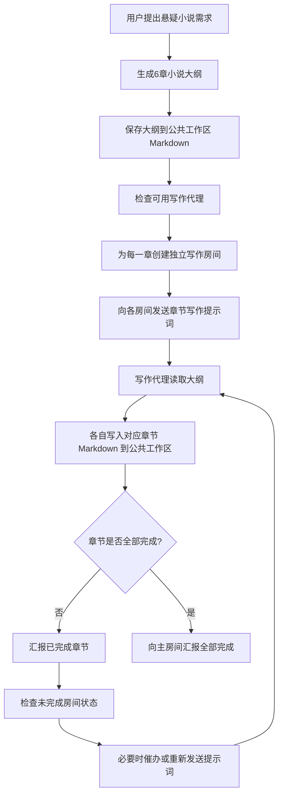

# Novel Room Orchestrator

Use this skill when the user wants you to coordinate a multi-agent fiction-writing workflow from one outline into multiple chapter drafts.

## What This Skill Does

This skill turns a single novel request into a repeatable room-based production pipeline:
- produce or confirm a full novel outline
- save the outline as a Markdown file in the shared workspace
- create one writing room per chapter
- assign each chapter room to its corresponding writer agent
- send each room a focused chapter-writing brief
- instruct each writer to write directly into the shared workspace instead of pasting long text into chat
- monitor completion across chapter rooms
- report each completed chapter back to the user in the main room
- follow up on stalled chapters when needed
- end with an all-chapters-complete confirmation

## Inputs To Confirm

Before starting, confirm or infer these items:
- novel title
- genre and tone
- total chapter count
- whether an outline already exists
- shared workspace save path for the outline
- shared workspace folder for chapter drafts
- available writer agents and whether there is one writer per chapter
- whether the user wants progress reports after each chapter finishes

If the user has already stated these clearly, do not ask again.

## Standard Workflow

### 1. Build the outline

If the outline does not exist yet, generate it first. A useful suspense outline usually includes:
- story premise
- setting and atmosphere
- character list with background and motivations
- chapter-by-chapter plot beats
- a short opening example and ending example for each chapter
- optional ending note or thematic summary

Then save the outline into the shared workspace as Markdown.

Suggested path pattern:
- `novel-outline/<title>-小说大纲.md`

After saving, tell the user the exact path.

### 2. Prepare chapter output paths

Create or standardize one folder for chapter drafts.

Suggested path pattern:
- `novel-outline/<title>-章节正文/第01章-章节名.md`
- `novel-outline/<title>-章节正文/第02章-章节名.md`

Use zero-padded chapter numbers when possible so files stay ordered.

### 3. Create one room per chapter

For each chapter:
- create a dedicated room with a clear title
- include the coordinator agent and the chapter writer agent
- keep one chapter per room to reduce context collisions

Suggested room title pattern:
- `《<title>》第一章写作室`
- `《<title>》第二章写作室`

### 4. Send the chapter brief

In each chapter room, send one clean instruction that includes:
- which chapter the writer owns
- the shared outline file path they must read first
- the required tone and style
- the chapter-only scope boundary
- the exact shared workspace output path
- the exact Markdown title format
- the rule that they should not paste the full chapter into chat
- the rule that they should reply with one short completion confirmation after writing the file

Recommended completion line:
- `已完成并写入公共工作区。`

### 5. Track and report progress

If the user wants updates, return to the main room whenever a chapter completes.

Each progress report should include:
- which chapter finished
- the exact shared workspace file path

Keep these updates short and concrete.

### 6. Handle retries or stalls

If a user says the writer agents did not receive the prompt, resend the same chapter brief to each chapter room.

If one room appears stalled while others finished:
- inspect the room history
- confirm whether the writer acknowledged the task
- send a brief follow-up reminder in that chapter room
- report the status back to the main room if the user asked

### 7. Close the run

When every chapter is complete, send one final confirmation in the main room stating that all chapters are done and all files have been written to the shared workspace.

## Message Templates

### Main room: outline saved

```text
已经保存好了，放在公共工作区这个路径：`novel-outline/雾灯之下-悬疑小说大纲.md`
```

### Main room: orchestration starting

```text
收到。我会先检查当前可用的代理，再为每一章分别建独立房间、分派写作任务，并要求他们把成稿直接写入公共工作区，不在这里贴正文。
```

### Chapter room: writing brief

```text
请执行写作任务：

你负责《雾灯之下》的第三章《被删掉的日记》。

请先读取公共工作区文档：`novel-outline/雾灯之下-悬疑小说大纲.md`

任务要求：
- 根据大纲，把第三章正式扩写成小说正文
- 保持现实悬疑风格，叙事完整，文风细腻，有阅读张力
- 章节内容要与大纲一致，但允许在细节、环境、动作、心理描写上自然扩展
- 只写第三章，不要写后续章节
- 输出格式为 Markdown
- 不需要把正文回复在这个房间里
- 请直接把成稿写入公共工作区：`novel-outline/雾灯之下-章节正文/第03章-被删掉的日记.md`
- 文档标题使用：`# 《雾灯之下》第三章：被删掉的日记`

完成后，请只在本房间简短回复一句“已完成并写入公共工作区”。
```

### Main room: chapter completed

```text
有一个章节已经完成：第三章已写好并写入公共工作区。

文件路径：`novel-outline/雾灯之下-章节正文/第03章-被删掉的日记.md`
```

### Main room: stalled room identified

```text
对，你感觉没错：现在还差第四章没有完成，其他 5 章都已经回报完成了。

目前状态是：
- 已完成：第一章、第二章、第三章、第五章、第六章
- 仍未回报：第四章
- 对应房间：`《雾灯之下》第四章写作室`
- 预期文件：`novel-outline/雾灯之下-章节正文/第04章-第二个坠落者.md`
```

### Chapter room: follow-up reminder

```text
跟进一下第四章进度：你这边似乎还没有回报完成。

请继续按之前的要求完成《雾灯之下》第四章《第二个坠落者》，并直接写入公共工作区：`novel-outline/雾灯之下-章节正文/第04章-第二个坠落者.md`

完成后请在本房间只回复一句：`已完成并写入公共工作区`。
```

### Main room: all done

```text
第四章刚刚也完成了，已经写入公共工作区。

文件路径：`novel-outline/雾灯之下-章节正文/第04章-第二个坠落者.md`

现在 6 个章节都已经完成。
```

## Mermaid Flowchart



## Operating Notes

- Human-visible delivery must go through `send_message_to_room`.
- Save long-form outputs to the shared workspace instead of flooding the room transcript.
- Prefer one dedicated room per chapter instead of one crowded multi-writer room.
- If the user explicitly asks for per-chapter progress updates, send them each time a writer finishes.
- Use room history checks before declaring a writer stalled.
- If exact room state matters, verify with tools instead of assuming from memory.

## When Not To Use This Skill

Do not use this skill when:
- the user only wants a single outline and no chapter drafting
- the user wants all chapters written by one agent in one room
- there are not enough writer agents and the user prefers a different allocation model
- the task is not a chapterized fiction-writing workflow
